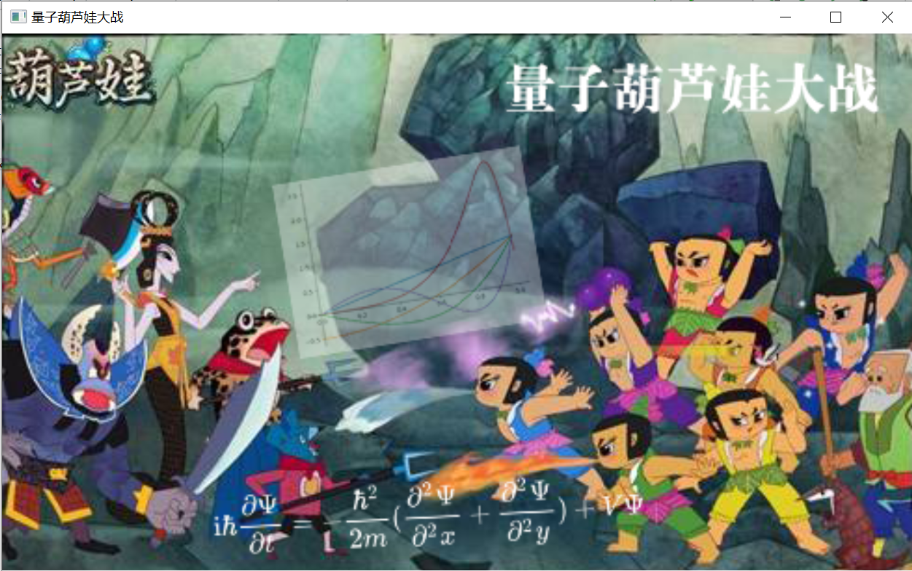
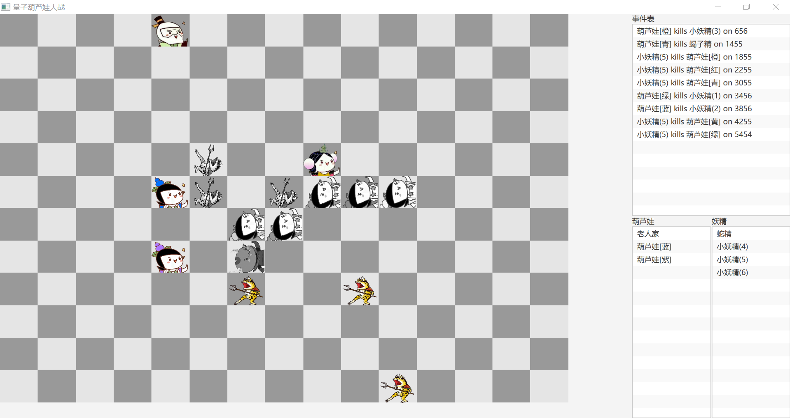

# 量子葫芦娃大战-Java课程设计

* 姓名：马兴越
* 学号：171870660
* 院系：现代工程与应用科学学院
* JDK版本：JDK1.80_221
* 主类：`top.xep0268.calabashes.Main`

## 概要

首先给出的是整体的界面布置。操作方法和要求文档中的一致。本项目的主体部分是从第四次作业拷贝过来的，但本文档是重写的。为了完整起见，仍然第4次作业中涉及的部分进行说明，但不作为重点。

程序启动后首先展示启动界面，此界面保留大约1秒。

然后进入主界面，双方列队。此时可以按空格开始战斗，或者按`L`读取记录文件来回放。战斗过程中，生物体按照一定逻辑移动（后面详述），当两个生物体进入8邻域内相邻时，则二者中有一个会死亡，死亡概率由**量子力学**原理计算导出（狗头x）。死亡的生物体变成“横着的”，并且颜色变为黑白。

如下图所示是程序主界面。左侧是战场，以深浅不同、互相交错的灰色标记，每一时刻每一格内至多有一个生物；右侧是战况的概要，其中“事件表”列出了所有生物杀死的事件及其发生的时间（从按下空格键开始计时，以毫秒为单位）；下面的“葫芦娃”和“妖精”两栏的`ListView`显示双方当前存活的生物。

当一方生物全部死亡后，则弹出对话框提示哪一方获胜。点击“确定”关闭对话框后，战场重新布局。

### 核心设定

我们对战场的物理环境和生物能力做如下的规定。

1. 生物在场地中的移动只能**逐步**完成，且每一步只能在**八邻域**意义下相邻的两格之间移动。我们规定，在布阵时，生物体之间可以交换位置；但在战斗开始后，生物体只能移动到一个空位中。

2. 战斗开始后，生物以（看起来）类似时钟同步的方式进行移动，每个“时钟周期”内只能移动一步（上一条所规定的意义下的一步）。

   > 需说明，此处“时钟同步”只是个表象。实际上，每个生物体是独立的线程，只是在每次更新后`sleep`一个周期长度（规定在`Game.INTERVAL`）。

3. 生物体相遇时候的死亡概率由二者所处时空位置波函数模方的相对大小决定，具体表达形式和推导详见附录部分。

## 代码设计

