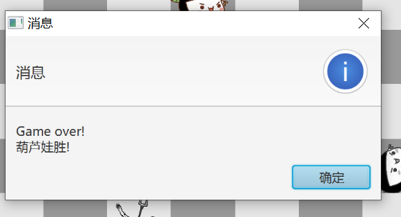

# 量子葫芦娃大战-Java课程设计

* 姓名：马兴越
* 学号：171870660
* 院系：现代工程与应用科学学院
* JDK版本：JDK1.80_221
* 主类：`top.xep0268.calabashes.Main`


## 概要

首先给出的是整体的界面布置。操作方法和要求文档中的一致。本项目的主体部分是从第四次作业拷贝过来的，但本文档是重写的。为了完整起见，仍然第4次作业中涉及的部分进行说明，但不作为重点。

程序启动后首先展示启动界面，此界面保留大约1秒。


然后进入主界面，双方列队。此时可以按空格开始战斗，或者按`L`读取记录文件来回放。战斗过程中，生物体按照一定逻辑移动（后面详述），当两个生物体进入8邻域内相邻时，则二者中有一个会死亡，死亡概率由**量子力学**原理计算导出（狗头x）。死亡的生物体变成“横着的”，并且颜色变为黑白。

如下图所示是程序主界面。左侧是战场，以深浅不同、互相交错的灰色标记，每一时刻每一格内至多有一个生物；右侧是战况的概要，其中“事件表”列出了所有生物杀死的事件及其发生的时间（从按下空格键开始计时，以毫秒为单位）；下面的“葫芦娃”和“妖精”两栏的`ListView`显示双方当前存活的生物。


当一方生物全部死亡后，则弹出对话框提示哪一方获胜。点击“确定”关闭对话框后，战场重新布局。



程序记录文件保存在启动目录的子目录`CalabashLogs`下。如果该目录不存在，将会被创建。文件以`Log-日期-时间.dat`命名，例如`Log-2019-12-13-21-59-05.dat`。

### 核心设定

我们对战场的物理环境和生物能力做如下的规定。

1. 生物在场地中的移动只能**逐步**完成，且每一步只能在**八邻域**意义下相邻的两格之间移动。我们规定，在布阵时，生物体之间可以交换位置；但在战斗开始后，生物体只能移动到一个空位中。

2. 战斗开始后，生物以（看起来）类似时钟同步的方式进行移动，每个“时钟周期”内只能移动一步（上一条所规定的意义下的一步）。

   > 需说明，此处“时钟同步”只是个表象。实际上，每个生物体是独立的线程，只是在每次更新后`sleep`一个周期长度（规定在`Game.INTERVAL`）。

3. 生物体相遇时候的死亡概率由二者所处时空位置波函数模方的相对大小决定，即**老人家公式**（*The Elder's Formula*）。具体的表达形式和推导详见附录部分。


## 结构设计

由于整个项目涉及的类比较多，一张类图画不下，所以我们拆分成多个类图来展示。

首先要给出的是**抽象层**总体布局类图。这张类图主要精确到抽象类、接口层次，并列出了必要的实体类。程序中与异常相关的`exceptions`包没有列在类图上。


现在在package的层次上简单说明整个程序的顶层设计。

* `items`包，是所有生物体类所在的包。抽象类`Item`是逻辑意义上的生物体，剥离了图形界面部分；其抽象子类`Living`主要是添加了图形界面的支持。所有的真实生物，都是`Living`的子类。`Leader`接口是领导排队的生物。
* `field`包。主要包含与场地实现有关的类。类`Block`表示逻辑意义上的一个单元格，场地`Field`是其集合；`Position`类属于生物对象，记录该生物所处位置。
* `formations`包，包括对阵型的支持。主要有抽象的阵型类`Formation`和布阵的泛型处理类`FormationHandler`。
* `log`包，是记录与读取记录的支持。程序中的事件都是`AbstractEvent`的子类，通过`EventWriter`和`EventReader`进行写入和读取。
* 基本包。主要是游戏进行的逻辑支持。`Game`包含启动、布阵的基本逻辑，`Judger`和`JudgeHandler`主要以类似消息队列的方式处理生物发生冲突的事件（决定谁死谁活）。`Game`是最顶层的类；`Main`没有列出。

大多数的与图形界面相关的类，采用**继承**的方法实现。即，创建一个逻辑上的基本类，例如`Block`，其中不包括图形界面，可以单独测试核心逻辑；再创建其子类，加入对图形界面的支持。为了实现好这部分逻辑，用了较多的泛型。

图形界面全局布局采用FXML实现。布局文件见资源文件中的`MainPane.fxml`文档。与其绑定的controller类是`MainPaneController`类。

## 代码设计

这部分将逐个包、逐个类说明其设计和重要的逻辑，并阐明所遵循的**设计原则**和使用的**设计模式**。

### `items`包

首先给出这部分的详细类图。图中没有画出注解类。


#### `Item`类

这个类实际上对应于前几次作业中的`Living`类，包含了其中的大多数逻辑。`Item`类含有一个`Position`对象，记录当前`Item`所处的位置。`Item`类中实现了生物体的移动`move`和寻路`pathTo`方法，这部分在前几次作业的报告中已经详细地说明过了，这里不再赘述。这里重点讨论多线程的支持。

##### 多线程

`Item`是`java.util.concurrent.Thread`的子类。用一个标志位`inVideo`标示是否处于回放模式下。重写的`run()`方法分成两种情况。

**第一**，当系统处在运行模式（即按空格后）时，调用`live()`方法。每隔一个时钟周期（定义在`Game.INTERVAL`常量中），执行一次更新。每次更新随机地选取一个敌对生物作为攻击目标，以倾向于该生物所在方向的一个随机方向前进一步。

> 说明两点：
>
> 1. “倾向于该生物所在方向的一个随机方向”，是指主体生物随机向八邻域内某个方向走一步，但走到目标生物方向的概率最大。
> 2. 之所以不采用确定的算法（即：直接向该生物所在方向走一步），一方面是因为这样将导致游戏结束太快，另一方面是因为在两生物之间有特定结构的障碍物的情况下，容易造成死循环。另一方面，之所以不采用完全随机的算法，是因为这样将导致进行到最后（只剩少数几个生物）的时候，敌对双方很难遇到，很久不能结束。

完成一步后，检查其八邻域内是否有敌对生物。如果有敌对生物，则将自身与对方加入判断队列中（实际上是执行`Game.decide()`方法）。

**第二**，当生物处在回放模式时，目前的实现里，生物线程并不需要做什么事情。

当生物死亡时，由`Game`调用`die()`方法，将`active`标志位置为`false`，并中止当前线程。

##### 抽象方法

线程更新中，查找敌人和判断邻域敌人的方法，需要使用依赖`Game`对象，所以使用抽象方法实现，属于**模版方法**设计模式。整个`Item`类的核心原则是与`Game`和图形界面元素解耦，这体现了**接口隔离原则**。

#### `Living`类

这是`Item`类的图形界面版本。程序中真实的生物都是其子类。本类具有一个`Pane`成员，主要时有一个`ImageView`组件，其内容是生物的图片，从资源文件中读取。当生物移动时，除调用基类方法外，还要写入记录；当生物死亡时，还要更新图片为死亡生物的图片。

在程序中的绝大多数地方，都采用`Living`和`Item`引用，而非具体的生物实体类。大多数的程序都仅依赖于`Living`类，这自然体现了**依赖倒置原则**和**李氏替换法则**。

#### `Leader`接口

`Leader`接口是与布阵有关的接口。凡是指挥布阵的生物，都实现这个接口。接口只有一个泛型方法，

```java
<T extends Formation> void embattleFormation(Class<T> formType)
            throws NoSpaceForFormationException;
```

当需要布阵时，从生物调用这个方法，方法内部使用`FormationHandler`来实现布阵。

#### `Elder`类

生物体的具体实现类大多是平凡的。这里以老人家类（`Elder`）为例，说明与具体实现相关的一些事情。

在每个实体类中，实现基类的抽象方法`getResourceName`，利用动态绑定，获得生物的图片文件名来加载。这是模版方法的一个实例。

##### 生物阵营的标记

生物阵营的标记是采用**注解**(Annotation)实现的。对于葫芦娃阵营的生物，用注解`@WithCalabash`来标记；对于妖精阵营的，用`WithDemon`来标记。在系统判断何方获胜时，利用反射机制，获取注解来判断阵营。

#### `PassedFlag`

最后说明一下`PassedFlag`类。这是主程序中，`Item`实体子类中唯一一个不继承`Living`的，仅仅是个逻辑上的场地上元素。它的作用是，在**寻路**过程中，复用`Field`部分的代码，作为已经走过的单元格的标记。寻路算法详见前几次作业的报告。

逻辑上，虽然看起来比较奇怪，这样的设计也是有合理之处的。我们并没有说，`PassedFlag`是一种生物，而只是说它是，逻辑上的，场地上的元素。只是这里的“场地”并非是实体的场地（后面将说到的`BattleField`），而只是一个抽象的场地，罢了。

### `field`包

`field`包的内容是所有对场地部分的支持。首先是本包内部的详细类图


#### `Block`类

这是本次课程设计编码中新增加的一层抽象，表示一个只能站立至多一个生物的单元格。这是一个**泛型**类，其模版参数是`<T extends Item>`，即元素类型，在具体的实现中只需精确到`Living`即可。这里使用泛型是为了让`Field` - `Block` - `Item` 三个层次之间实现**协变**，也就是能创建出，仅逻辑上的`Field`和支持图形界面的`Field`。

##### 线程安全

需修改状态的两个方法，即`setLiving()`和`removeLiving()`都采用了`synchronized`同步方法，这样使得同一个单元格同一时间只能由一个生物体修改其状态。

#### `GraphicBlock`类

是`Block<Living>`的子类。相比`Block`，主要是多了图形部分`Pane`，且当单元格状态变化时，同步修改图形部分。

#### `Field`类

这个类的逻辑和前几次作业中的`Field`基本一样，但改为了泛型类。泛型参数是`<T extends Block>`，即单元格类型。由于需要创建`T`类型的对象，需要利用**反射**机制，在本类的构造方法中接受一个`Class<T>`类型的参数，私有方法`T instanceBlock(int i, int j)`逻辑上相当于`new`。

与生物体移动、增加、删除有关的方法全部复用了前几次作业中的方法，不再赘述。

#### `BattleField`

前述的`Field`类是逻辑上的战场，而`BattleField`是游戏中采用的战场，采用**单例类**设计模式。本类是`Field<GraphicBlock>`的子类。

这里补充说明一下逻辑意义上的`Field`类的意义了。程序中有两个地方用到了，

* 在寻路算法的实现中，记录已走过的地方的时候，相当于使用了`Field<Block<PassedFlag>>`。
* 在单元测试中，用于测试基本逻辑，而不借助图形界面。

#### `BattleGridPane`类

这是一个纯粹的图形界面类。使用`javafx.scene.layout.GridPane`作为基类，组织图形界面最核心部分，即战场的图形界面。本类也使用**单例**模式。

独立本类的需求来自于，使用FXML构建主界面布局。由于这个类需要做很多限定，所以使用FXML似乎并不是一个合理的解（会出现大量重复代码），故用Java代码构建界面。提供静态方法`getInstance()`，在FXML中指定为`fx:factory`属性。虽然名字如此，不过应该不算工厂模式，而说成单例模式更恰当一些。

#### `Position`及`Position.Direction`类

这是从第二次作业开始就设计了的类。与前面不同，这个类逻辑上是合成于`Item`的，记录对象的位置。

`Position.Direction`是**内部类**，用于表示以某一个位置坐标（`Position.this`）为中心的八邻域内的方向，常用方法是`adjacentPosition()`和`aStep()`，分别是保持当前位置不动，返回一个新的邻接点位置坐标，和移动一步当前位置。利用Java内部类的语言特性，可以很方便地完成这个操作。

### `formations`包

包括对阵型和布阵的全部支持。这个包内部的详细类图如下


#### `Formation`及其子类

`Formation`类在逻辑上的地位是，指出一种阵型的**形式**。这种形式是基于相对坐标表示的，与具体位置无关的形式。本类及子类也不负责布阵的实现。

对外的接口方法是：`public Position[] positions(Position center)`，返回根据领头者位置`center`做线性变换得到的所有从者的位置坐标。

基类有抽象方法`protected abstract void form()`，在构造函数中调用，给出所有从者的相对位置。各个具体的子类，只需实现这个方法。

目前实现了四种阵型，按上图中的顺序分别是：长蛇阵、鹤翼阵、锋矢阵、雁行阵。其他的阵型虽然没有实现，但如需实现也是非常简单的，只需要在`form()`中构建出相对坐标即可。

#### `FormationHandler`类

这是布阵的处理器类，可以理解为对布阵领导者行为的**代理**(Proxy)。提供的接口方法是`embattle()`，此方法使领导者寻找一个可以布阵的位置，并使从者按阵型站立。这样设计的主要目的是减少重复代码。蝎子精和老人家都要指挥布阵，其代码逻辑是差不多的。

逻辑上本类只依赖于`Formation`抽象基类，这是对**最少知识原则**和**依赖倒置原则**的体现。每次需要新增一种阵型时，只需要添加一个`Formation`的具体子类，不必修改基类和本类，这是**开放封闭原则**的体现。

本类的实现利用了**泛型**和**反射**的机制。调用者只需要传入具体阵型的`class`对象，本类利用反射获取其默认构造函数，创建实例。

### `log`包和记录基本设计

本包包括了对记录战斗过程和回放战斗过程的主要支持。详细类图如下


本包的内部结构和`formations`包有点类似，都是一个抽象类和仅依赖于抽象类的处理器，以及抽象类的几个具体子类，同样是依赖倒置原则、最少知识原则的体现。

本项目对记录和回放的实现是基于**事件**的。在程序运行时，记录**事件**发生的时间（从按下空格开始计时，记录绝对时刻，以毫秒为单位）、地点（基于`Position`对象）和有关的生物（`subject`主语，`object`宾语）。在回放时，以选定文件为0时刻，按时间依次重现以上事件。

在程序中需要记录的事件有以下三类，

* 生物创建事件`LivingCreatedEvent`。记录的是布阵完成，游戏开始前，生物所处的位置。
* 生物移动事件`LivingMoveEvent`。记录生物在某个时刻`timeStamp`由`oldPosition`移动一步到`position`的事件。
* 刺杀事件`KillEvent`。记录某时刻`timeStamp`某生物`subject`在某地点`position`杀死另一生物`object`的事件。

每个事件都是一个`AbstractEvent`对象，通过**序列化/反序列化**实现记录和读取。涉及到的`AbstractEvent`，`Item`（`Living`的基类），`Position`等类都实现了`Serializeable`接口。

`EventWriter`是对`ObjectOutputStream`的封装，采用**合成**结构。仅提供接口方法`write(AbstractEvent event)`来实现写入。当游戏在运行模式（按下空格后）时，每当生物创建、移动、死亡时，都将记录调用一次`write()`，记录一个新的事件。

类似的，`EventReader`则是对`ObjectInputStream`的封装，其`read()`方法每次读取一条记录（产生一个`AbstractEvent`对象）。

### `exceptions`包

包含两个异常类`PathNotFoundException`和`NoSpaceForFormationException`，都是和布阵过程有关的异常。这部分在之前作业的报告中已经详细阐述，不再赘述。

### 游戏逻辑

这部分主要要讲的是不在子包里的几个类。类图在顶层设计中已经比较清楚地展示过了，这里不再赘述。

#### `Game`类

这是整个游戏逻辑上的顶层类。主要逻辑的组织都通过本类完成。根据实际需要，采用单例模式。当游戏启动时，由本类负责创建生物体实例、初始化阵型和界面；当用户按下空格键时，调用本类方法`begin()`，启动所有生物体线程；当用户按下`L`并选好文件后，调用方法`loadLog(File)`，进入回放模式。当生物体间发生冲突时，调用`decide()`方法，实际上是将消息转发给`JudgeHandler`事件处理队列，由后者进行进一步处理。当生物死亡时，调用`livingDies()`方法，将生物从`activeLivings`列表中移除。

##### 运行状态并发与线程安全

本段主要说明，**运行状态**（按下空格后）的并发和线程安全相关问题。

此过程中，整个程序的线程大概分为以下几类，

* 生物体线程。`Item`继承`Thread`类实现。按下空格后，由本类负责启动各个生物体线程。
* 判断队列线程，指`JudgeHandler`。由`ScheduledExecutorService`控制，每隔一定时间，运行一次，处理队列中的事件。
* `Game`自身线程。主要是每个时钟周期检查游戏是否结束，同时可以给出一些调试信息。

当生物死亡时，该生物线程将被中断（`interrupt()`）；当游戏结束时，所有生物线程将被中断。

运行状态下的线程安全问题主要由两个。

**一是**生物死亡和生物移动问题，即一个生物不能同时死亡两次；两个生物不能同时进入同一个地块。解决方案很简单，把`Block`中相关方法和`livingDies()`方法标记为`synchronized`即可。

**二是**生物冲突时的生死判断问题，这个问题比较棘手，用了四五天才解决。

由于生物死亡的判断会同时涉及两个生物体，而针对每个生物的判断又必须是同步的（否则可能出现一个生物死亡两次的问题），这样导致每一个判断生物生死的任务必须获取两个生物的同步锁。这将导致dead lock问题。在实际编码中，由于需要使用`synchronized`同步代码块，导致线程会在等待这个同步锁的状态进入Blocked状态，且无法中断。但由于生物与其他生物的冲突是不可预测的（哪两个任务会同时申请同一个资源是不确定的），就没有办法通过调整申请资源顺序的方法来回避dead lock问题（不能像the dining philosopher problem一样处理）。

最后采用的解决方案是，引入事件队列的方法。每次生物发生冲突时，并不直接判定，而是将冲突事件包装成一个`Judger`对象，加入到`JudgeHandler`中.`JudgeHandler`实质上是一个封装的`BlockingQueue`，它每隔一定的间隔处理一次队列，即依次取出所有的`Judger`对象，判断两个生物生死。由于这个处理间隔比较小，队列的延迟不会产生太大的影响。

##### 回放的实现

当用户按下`L`时，直接在`main`方法的匿名类中读取文件（因为需要使用`primaryStage`作为父结点），然后将`File`对象传给`Game.loadLog()`方法，此方法的调用标志着回放正式开始。

回放的基本逻辑是，按照记录的事件顺序，以回放调用瞬间为0时刻，偏移事件所指定的时间，来重现事件。`loadLog()`方法创建一个`EventReader()`对象，一次性读取完所有的事件，利用反射机制判定事件的具体类型，然后分别分发给`loadLiving()` `scheduleMove()` `scheduleKill()`三个方法做处理。

由于记录的时间差，有时候会出现移动事件发生在创建事件以前几个毫秒的情况，此时指定的`Living`对象还没有初始化，将引发异常。为了解决这个问题，采用的方案是实现事件的排序，将所有的`LivingCreatedEvent`放在最前面。

`loadLiving()`方法直接使用事件中记载的`Living`对象（`Living`的基类`Item`实现了`Serializeable`接口）。由于其中的`Game`等引用使用了`transient`标记，读出来的结果是`null`，所以在设置进入回放模式时，同步地更新好这些引用。此时`Living`对象已经和正常运行情况下的`Living`对象没有什么区别了，所以复用`startLivingThread`方法即可。

`scheduleMove`方法直接在`Game`类的`ScheduledExecutorService`中计划移动事件。直接指定，在偏移指定的时间后，进行一次移动即可。

> 曾经尝试过，将各个生物体的移动事件分发给生物体对象来执行。但可能是由于JVM在不同线程间切换的速度相对较慢，导致了移动的实际时间和计划时间相差很大，从而回放效果和当时的游戏场景明显不一样。考虑到这个问题，将移动事件改为中心化的计划。

`scheduleKill`方法计划在指定时间执行生物死亡事件。

##### 回放线程安全问题

使用毫秒数记载事件发生的具体时间会存在一个问题，即两个有一定互相影响的生物可能会同时移动（如果仅仅`Block`的移动相关方法是同步方法），或者即使不是同时移动的，相差的时间是个小于毫秒的小量，但读取记录的时候失去了这个先后的顺序，则回放执行的先后顺序就是不确定的。由此导致，运行时可行的一个移动，在回放时可能会失败

> 例如，生物1离开单元格A，0.5ms后生物2移动到单元格A。如果回放时，后一个记录先被执行，则此时A单元格被占用，移动失败。

一次移动的失败就会造成当前棋盘状态与运行时不同。由于我们记录的是状态的增量而非状态本身，这就会造成后续的状态始终与运行时状态不同，引发连锁反应。在异动前做了检查，较多时发现几百次移动前位置和记录位置不匹配的现象。

等待显然不是一个可行的解，因为这样可能造成dead lock问题。

采用的解决方案是，将全局的`Field.moveLiving()`方法设成同步方法，且在其退出前，如果非是在回放模式，则等待2毫秒，这样保证不同的移动事件发生的时间严格不同。经过测试，确实解决了问题。

当然，这样不可避免地造成了效率的下降。但在本实现中，全局的生物体有16个，也就是说最大情况下造成的等待也只是32毫秒左右，相比于时钟周期长度大约400毫秒，这个时间的影响是很小的。

### 单元测试

单元测试的代码位置符合maven的一般目录结构要求。单元测试主要测试的是`Item`的移动、寻路算法和`Formation`, `FormationHandler`的布阵代码。

前面说过，设计`Item`时，我将它设计为逻辑上的场地元素，也就是剥离了对`Game`和图形界面的依赖。这个设计再单元测试中起到了很方便的作用。为方便测试，编写了`Item`的子类`LogicalItem`及后者的子类`LogicalLeader`（作为`FormationTest`的静态内部类），基本上是对`Item`中抽象方法的空白实现。得益于前面的设计，测试用到的`Block` `Field`都是不依赖于图形界面的，因此测试过程不需要弹出图形界面窗口。

本项目的单元内部没有很复杂的逻辑，复杂性更多体现在并发上，在单元测试中很难测试出来，因此单元测试的内容比较少。

### 图形界面概述

todo

## 语言特性的应用

本节我将把项目中用到的语言特性和面向对象设计原则、设计模式单独提出来说明。大多数的语言特性和使用的原因已经在上一节《代码设计》中详细阐明了，这里只做一个索引，并对有必要的做一些说明。

### 面向对象基础特性

整个程序的基础就是对地块`Block`、场地`Field`、场地上元素`Item`的面向对象建模，封装了生物移动、生物死亡等操作和位置等属性；`Item`的继承关系应用了继承和多态的特性。这部分在前几次作业的报告和前面的内容中已经说得比较多了，无需重复。

### 设计原则

* 利用逻辑基类`Item`，`Block` `Field`抽离图形界面部分，体现了单一职责原则（SRP）。
* 阵型`Formation`，事件`AbstractEvent`的具体子类可以很方便地后期添加，且不需要修改处理逻辑（`FormationHandler`和`EventReader/Writer`），体现了开放封闭原则（OCP）。
* 程序中的子类型都可以替换基类。这一点尤其体现在，将原来混合了图形界面的`Living`抽离图形界面后，新添加的`Living`类可以替换在原来基类的位置上，体现Liskov替换法则（LSP）。
* 将`Leader`接口和`Item`抽象类分离开，体现接口隔离原则（ISP）。
* 程序中对事件和阵型的处理，绝大多数地方都仅仅依赖于抽象的基类；对元素`Item`的处理，大多数也仅依赖于抽象类`Item`或者`Living`，体现依赖倒置原则（DIP）和最少知识原则（LoD）

### 异常处理

主要体现在布阵过程中。编写了两个异常`NoPlaceForFormationException`和`PathNotFoundException`，都在`exceptions`包中。

### 集合类型

`Game`中对存活和死亡生物的管理采用`List<Living>`；`Field`对地图的保存采用了`List<List<Item>>`（主要是为了方便和泛型合作，否则用数组更加方便）等。

### 泛型和反射

* `FormationHandler`类对于阵型的处理，使用泛型机制，并用反射创建对象。
* `Block<T extends Item>`采用泛型，并同样用反射创建对象。
* `Field<T extends Block>`采用泛型。
* 对生物所属阵型的判断，采用反射（结合注解）。

其中`Block`与`Field`采用泛型是为了实现，类似容器协变的效果。详见前文相关部分。

### 注解

注解机制主要用于标记生物所属于的阵营。定义保留到运行时的Marker annotation `WithCalabash`和`WithDemon`，对葫芦娃和老人家类使用前者，对蝎子精、蛇精、从者类使用后者，在需要时，通过反射获取注解，实现阵营的判断。

这部分本来是用声明性的接口来实现的。但后期重构为注解，理由是注解更加简洁明确，符合逻辑。

### 输入输出

除了`System.out.println()`外，主要是在记录和读取部分应用到了IO机制。用`ObjectInputStream`和`ObjectOutputStream`实现记录的读取和写入，详见相关章节。

### 设计模式

* `Game` `BattleField` `BattleGridPane`类采用单例设计模式。
* `Item`中基础逻辑的实现采用了模版方法设计模式。
* `FormationHandler`使用代理设计模式。


# 附录：葫芦娃波函数的量子力学推导

> 建议使用支持Latex的Markdown编辑器阅读本段，例如Typora。

**遇事不决，量子力学**。我们用量子力学基本理论分析葫芦娃大战妖精所处空间的性质。

设空间为二维空间，存在葫芦娃和妖精的能量场，其能量强度满足薛定谔方程

$$
\mathrm{i}\hbar\frac{\partial \Psi}{\partial t}=-\frac{\hbar^2}{2m}(\frac{\partial^2 \Psi}{\partial ^2 x}+\frac{\partial ^2 \Psi}{\partial ^2 y})+V\Psi
$$

由于所有生物都不能超出图幅，所以势函数可以按二维无限深方势阱处理

$$
V(x,y)=
\left\{ \begin{array}{rcl}
&0 & ,0<x<a, 0<y<b\\
&\infty &,\mbox{otherwise}
\end{array}\right.
$$

由分离变量法，根据无限深方势阱的边缘的波函数显然是0做定解，容易得到时间部分的解和空间部分的通解、量子化的能量

$$
\begin{align*}
\phi(t)&=\mathrm{e}^{-\frac{iE_{m,n}t}{\hbar}}\\
\psi (x,y)&= \sum_{m=1}^\infty \sum_{n=1}^\infty \sin(\frac{n\pi x}{a})\sin(\frac{m\pi y}{b})\\
E_{m,n}&=[(\frac{n}{a})^2+(\frac{m}{b})^2]\frac{\pi ^2 \hbar^2}{2m}
\end{align*}
$$

又考虑到空间关于$y$方向是对称的，所以量子数m只取1；又设葫芦娃和妖精对应的量子数$n$分别为0和1，初始时刻是等概率的波函数叠加。根据初始条件做傅里叶展开，并做归一化，我们略去详细过程，直接给出波函数的解

$$
\begin{align}
\Psi(x,y,t)=\sqrt{\frac{2}{ab}}\sin(\frac{\pi y}{b})[(\sin(\frac{\pi x}{a})\mathrm{e}^{-\mathrm{i}(\frac{1}{a^2}+\frac{1}{b^2})\frac{\pi^2\hbar t}{2m}}+\sin(\frac{2\pi x}{a})\mathrm{e}^{-\mathrm{i}(\frac{4}{a^2}+\frac{1}{b^2})\frac{\pi^2\hbar t}{2m}}] 
\end{align}
$$

根据量子力学的统计诠释，波函数的模方表示粒子出现在该位置的概率

$$
|\Psi(x,y,t)|^2= \frac{2}{ab}\sin^2(\frac{\pi y}{b})[\sin^2({\frac{\pi x}{a}})+\sin^2(\frac{2\pi x}{a})+2\sin(\frac{\pi x}{a})\sin(\frac{2\pi x}{b})\cos(\frac{3\pi^2\hbar t}{2a^2m})]
$$
这就是葫芦娃与妖精大战中所满足的方程。

当葫芦娃与妖精在8邻域内接触时，相互之间发生冲突，则二者生死概率由其所处时空位置的能量大小决定。在充分多的系综下我们不妨作简化，**设两生物发生冲突时，所在时空位置能量较高的一方存活**。

在编码过程中，简化起见，我们设空间的时间和空间（格子）的都是基本单位的整数倍，

$$
\begin{align}
\hat{t}&=\frac{2m}{3\pi^2\hbar}\\
\hat{x}&=\frac{1}{a\pi}\\
\hat{y}&=\frac{1}{b\pi}
\end{align}
$$

定义以上述基本单位为单位的相对值，

$$
\begin{align}
t_r&=\frac{t}{\hat{t}}\\
x_r&=\frac{x}{\hat{x}}\\
y_r&=\frac{y}{\hat{y}}\\
\end{align}
$$

又程序中我们只需要比较，所以归一化常量没有实际意义，则波函数模方简化为

$$
|\Psi (x_r,y_r,t_r)|^2=\sin^2(y_r)[\sin^2(x_r)+\sin^2(2x_r)+2\sin(x_r)\sin(y_r)\cos(\frac{t_r}{a^2})]
$$

此公式由葫芦娃的爷爷最先导出，故称为**老人家公式**（*The Elder's Formula*）。这就是Java代码中使用的表达式。

